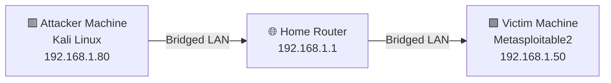

# 01 — Lab Setup & Network Configuration

## 🎯 Goal of This Step
Build two virtual machines and make sure they can talk to each other on the same private network — this is the foundation before any attack can happen.

## 🔑 Machines in This Step

| Role | Machine | IP Address |
|------|---------|------------|
| 🟥 Attacker | Kali Linux | `192.168.1.80` |
| 🟩 Victim / Target | Metasploitable 2 | `192.168.1.50` |

These two IPs are fixed and used everywhere in this repo — they never change.

---

## Step 1 — Update Kali Linux (🟥 Attacker Machine)
```bash
sudo apt update && sudo apt upgrade -y
```
**In plain English:** This just refreshes and installs the latest software on the Attacker Machine, like updating apps on a phone before using it.
- `apt update` — refreshes package list (1–2 mins)
- `apt upgrade -y` — installs all updates (10–30 mins on fresh install)

---

## Step 2 — Install Metasploitable2 (🟩 Victim Machine)
- Download: https://sourceforge.net/projects/metasploitable/files/Metasploitable2/
- Import into VirtualBox (File → Import Appliance)
- Default login: `msfadmin / msfadmin`

**In plain English:** This installs the machine that will be tested. It's built on purpose to be full of weaknesses, so beginners can practice attacking it safely.

---

## Step 3 — Network Configuration (Both Machines)

**Problem:** By default, VirtualBox's NAT mode gives both VMs the exact same IP (`10.0.2.15`) — like two houses sharing one address. They cannot see or talk to each other like that.

**Solution:** Switch both VMs to **Bridged Adapter** mode, so each one gets its own separate IP on the real network.

### 🟥 Attacker Machine (Kali) Settings — Settings → Network → Adapter 1:
| Setting | Value |
|---------|-------|
| Attached to | Bridged Adapter |
| Name | Intel(R) Centrino(R) Advanced-N 6205 |
| Promiscuous Mode | Allow All |

### 🟩 Victim Machine (Metasploitable2) Settings:
| Setting | Value |
|---------|-------|
| Attached to | Bridged Adapter |
| Name | Intel(R) Centrino(R) Advanced-N 6205 |
| Promiscuous Mode | Allow All |

---

## Step 4 — Verify IPs

**On 🟥 Attacker Machine (Kali):**
```bash
ifconfig
# eth0: 192.168.1.80
```

**On 🟩 Victim Machine (Metasploitable2):**
```bash
ifconfig
# eth0: 192.168.1.50
```

**In plain English:** This just confirms each machine got its own separate address, like checking your house number after moving in.

---

## Step 5 — Test Connectivity (run FROM 🟥 Attacker Machine, pointed AT 🟩 Victim Machine)
```bash
ping 192.168.1.50
# 64 bytes from 192.168.1.50: icmp_seq=1 ttl=64 time=0.xxx ms
```
✅ Both machines connected and ready.

**In plain English:** Kali "calls out" to Metasploitable2's address, and Metasploitable2 "answers back." If replies come through, the network setup is working.

---

## 🖼️ Network Diagram



---

## ⚠️ Safety Note
Metasploitable2 is **intentionally vulnerable**. Never expose it to the internet or a public network — only run it on a private, isolated lab network like this one.
