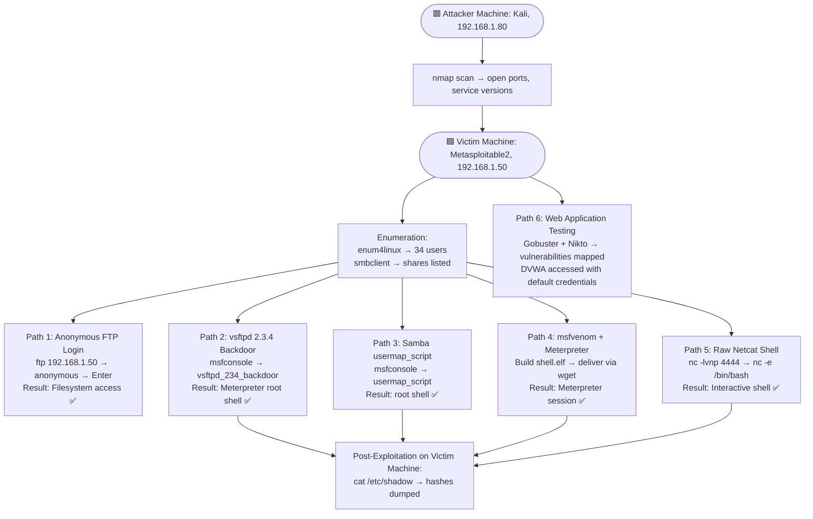

# 09 — Consolidated Findings Summary

## 🎯 Goal of This File
Bring together every weakness found across all previous steps into one master table, and show the full attack path from start to finish.

## 🔑 Machines Used Throughout This Lab

| Role | Machine | IP Address |
|------|---------|------------|
| 🟥 Attacker | Kali Linux | `192.168.1.80` |
| 🟩 Victim / Target | Metasploitable 2 | `192.168.1.50` |

---

## Lab Details

| Field | Value |
|-------|-------|
| Date | September 1, 2026 |
| Attacker Machine | Kali Linux 2026.1 — `192.168.1.80` |
| Victim Machine | Metasploitable2 — `192.168.1.50` |
| Lab Type | Controlled home lab — educational only |

---

## Complete Vulnerability Table

| # | Finding | Severity | CVE | Remediation |
|---|---------|----------|-----|-------------|
| 1 | vsftpd 2.3.4 backdoor — root shell via port 6200 | 🔴 Critical | CVE-2011-2523 | Upgrade vsftpd, verify checksums |
| 2 | Root Meterpreter session obtainable | 🔴 Critical | — | Patch vulnerable services |
| 3 | `/etc/shadow` readable with weak MD5 hashes | 🔴 Critical | — | Use SHA-512/bcrypt, strong passwords |
| 4 | Default credentials (`msfadmin:msfadmin`) | 🔴 Critical | — | Rotate credentials before deployment |
| 5 | Anonymous FTP login allowed | 🔴 Critical | — | Disable anonymous FTP |
| 6 | Samba 3.0.20 usermap_script RCE | 🔴 Critical | CVE-2007-2447 | Upgrade Samba |
| 7 | Anonymous SMB login + read/write access | 🟠 High | — | Restrict anonymous SMB |
| 8 | 34 user accounts exposed via enum4linux | 🟠 High | — | Disable null session enumeration |
| 9 | No account lockout policy | 🟠 High | — | Enable lockout after 5 attempts |
| 10 | Password complexity disabled, min length 5 | 🟠 High | — | Enforce complexity, min 12 chars |
| 11 | Apache 2.2.8 — end-of-life (2008) | 🟠 High | Multiple | Upgrade Apache |
| 12 | PHP 5.2.4 — end-of-life (2010) | 🟠 High | Multiple | Upgrade PHP |
| 13 | phpMyAdmin exposed unauthenticated | 🟠 High | — | Restrict to trusted IPs |
| 14 | TWiki 2003 — known RCE vulnerabilities | 🟠 High | Multiple | Upgrade or decommission |
| 15 | phpinfo.php publicly accessible | 🟡 Medium | — | Remove in production |
| 16 | Directory indexing enabled | 🟡 Medium | — | `Options -Indexes` |
| 17 | Missing security headers (CSP, HSTS, etc.) | 🟢 Low | — | Add headers in Apache config |
| 18 | HTTP TRACE method enabled (XST) | 🟢 Low | — | `TraceEnable off` |
| 19 | PHP Easter egg query strings enabled | 🟢 Low | — | `expose_php = Off` |
| 20 | ETag header leaks inode numbers | 🟢 Low | CVE-2003-1418 | `FileETag None` |

*(All findings above were discovered on the 🟩 Victim Machine, from commands run on the 🟥 Attacker Machine.)*

---

## 🖼️ Complete Attack Flow (All Paths, One Picture)

**In plain English:** There isn't just one way into the Victim Machine — there are six independent paths. Even if a defender patched one, the other five would still work. This is why the overall risk rating is Critical.

---

## Overall Risk Rating: 🔴 CRITICAL

Metasploitable2 represents a worst-case scenario of accumulated technical debt:
- Unpatched software spanning 15+ years
- Default credentials across multiple services
- Multiple independently exploitable services
- No security controls on any service

In a real environment, any **single** Critical finding would justify immediate incident response.

---

## Tools Used

| Tool | Purpose |
|------|---------|
| `nmap` | Port scanning and service detection |
| `ftp` | Anonymous FTP login testing |
| `smbclient` | SMB share listing and file access |
| `enum4linux` | Deep SMB/Samba enumeration |
| `msfconsole` | Metasploit Framework exploitation |
| `msfvenom` | Custom payload generation |
| `netcat (nc)` | Raw reverse shell |
| `gobuster` | Web directory enumeration |
| `nikto` | Automated web vulnerability scanner |
| `ssh` | Remote access via default credentials |

---

## Suggested Next Steps
*(Not performed in this exercise — planned follow-up work)*

- SQL injection testing via `sqlmap`
- Password cracking of `/etc/shadow` hashes with `john` or `hashcat`
- TWiki RCE exploitation
- Privilege escalation via kernel 2.6.24 local exploits
- Full DVWA exercise — SQL injection, XSS, file upload

---

*This report was created for educational purposes as part of the IIT Roorkee PG Certificate in AI/GenAI Powered Cybersecurity program (Cohort 2025–26).*
