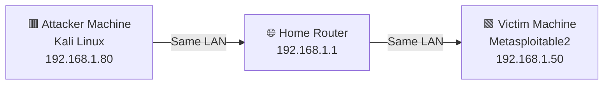

# 🛡️ Metasploitable 2 — Penetration Testing Lab

A hands-on educational penetration testing exercise performed against **Metasploitable 2**, an intentionally vulnerable Linux VM built by Rapid7 for security training purposes.

> ⚠️ **Educational use only.** All testing was performed in an isolated local lab environment (Kali Linux attacker VM ↔ Metasploitable 2 target VM, both on a private `192.168.1.0/24` network) with full authorization, as the tester owns and controls both machines. None of the techniques, commands, or findings here should be used against any system without explicit written authorization.

---

## 🔑 Legend — Know Your Machines (Read This First)

Every file in this repo uses the **same two machines with the same fixed IP addresses**, so there is never any confusion about who is attacking whom:

| Role | Machine Name | IP Address | Purpose |
|------|--------------|------------|---------|
| 🟥 **Attacker** | Kali Linux | `192.168.1.80` | Used to run all scans and exploits |
| 🟩 **Victim / Target** | Metasploitable 2 | `192.168.1.50` | Intentionally vulnerable machine being tested |

**Simple rule:** Kali (`.80`) always attacks. Metasploitable2 (`.50`) is always the one being attacked. These IPs never change anywhere in this repo.

---

## 🖼️ Network Diagram



---

## 🎯 Objectives

This lab walks through a complete penetration testing workflow, file by file:

1. **[01-lab-setup.md](./01-lab-setup.md)** — Goal: build the lab and confirm both machines can talk to each other
2. **[02-reconnaissance.md](./02-reconnaissance.md)** — Goal: scan the Victim Machine and understand what's running on it
3. **[03-ftp-exploitation.md](./03-ftp-exploitation.md)** — Goal: prove the FTP service needs no password
4. **[04-vsftpd-backdoor.md](./04-vsftpd-backdoor.md)** — Goal: gain full root control via a hidden backdoor
5. **[05-smb-enumeration.md](./05-smb-enumeration.md)** — Goal: check file-sharing service for open access
6. **[06-samba-exploit.md](./06-samba-exploit.md)** — Goal: gain root control via a second, independent bug
7. **[07-reverse-shells.md](./07-reverse-shells.md)** — Goal: show how a custom program can be delivered and run remotely
8. **[08-web-application.md](./08-web-application.md)** — Goal: test the website running on the Victim Machine
9. **[09-findings-summary.md](./09-findings-summary.md)** — Goal: consolidate every issue found, with severity and fixes

---

## 📊 Summary of Findings

| # | Finding | Severity |
|---|---------|----------|
| 1 | vsftpd 2.3.4 backdoor — root shell via port 6200 | 🔴 Critical |
| 2 | Root-level Meterpreter session obtainable | 🔴 Critical |
| 3 | `/etc/shadow` readable, weak MD5-crypt hashes | 🔴 Critical |
| 4 | Default credentials (`msfadmin:msfadmin`) | 🔴 Critical |
| 5 | Anonymous FTP login allowed | 🔴 Critical |
| 6 | Samba 3.0.20 usermap_script RCE | 🔴 Critical |
| 7 | Anonymous SMB login + read/write access | 🟠 High |
| 8 | 34 user accounts exposed via enum4linux | 🟠 High |
| 9 | No account lockout policy | 🟠 High |
| 10 | Password complexity disabled, min length 5 | 🟠 High |
| 11 | Apache 2.2.8 — end-of-life | 🟠 High |
| 12 | PHP 5.2.4 — end-of-life, multiple CVEs | 🟠 High |
| 13 | phpMyAdmin exposed unauthenticated | 🟠 High |
| 14 | TWiki 2003 — known RCE vulnerabilities | 🟠 High |
| 15 | phpinfo.php publicly accessible | 🟡 Medium |
| 16 | Directory indexing enabled | 🟡 Medium |
| 17 | Missing security headers (CSP, HSTS, etc.) | 🟢 Low |
| 18 | HTTP TRACE method enabled (XST) | 🟢 Low |
| 19 | PHP Easter egg query strings enabled | 🟢 Low |
| 20 | ETag header leaks inode numbers | 🟢 Low |

*(Full table with CVEs and remediation in [09-findings-summary.md](./09-findings-summary.md))*

---

## 📂 Repository Structure

```
Metasploitable_2/
│
├── README.md                        ← This file
├── 01-lab-setup.md                  ← VM config, network setup
├── 02-reconnaissance.md             ← System enum, /etc/shadow
├── 03-ftp-exploitation.md           ← Anonymous FTP login
├── 04-vsftpd-backdoor.md            ← vsftpd 2.3.4 backdoor exploit
├── 05-smb-enumeration.md            ← smbclient + enum4linux
├── 06-samba-exploit.md              ← Samba usermap_script root shell
├── 07-reverse-shells.md             ← msfvenom + netcat shells
├── 08-web-application.md            ← Gobuster + Nikto + DVWA
└── 09-findings-summary.md           ← Complete findings + remediation
```

---

## 🛠️ Tools Used

| Tool | Purpose |
|------|---------|
| `nmap` | Port scanning and service detection |
| `ftp` | FTP client for anonymous login testing |
| `smbclient` | SMB share listing and file access |
| `enum4linux` | Deep SMB/Samba enumeration |
| `msfconsole` | Metasploit Framework — exploitation |
| `msfvenom` | Payload generation |
| `netcat (nc)` | Raw reverse shell listener |
| `gobuster` | Web directory enumeration |
| `nikto` | Automated web vulnerability scanning |
| `ssh` | Remote access using default credentials |

---

## 👤 Author

**Megha** — Senior Patent Analyst & Cybersecurity Student
PG Certificate in AI/GenAI Powered Cybersecurity
IIT Roorkee × Futurense (Cohort 2025–26)
GitHub: [@meghaInfosec](https://github.com/meghaInfosec)
